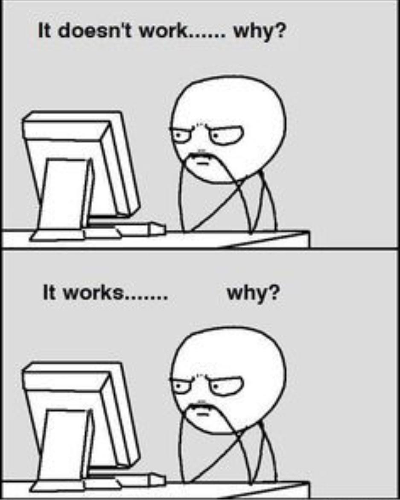
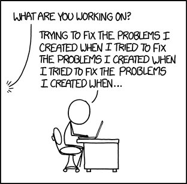

# Enjoy
### Memes

# Edabit Challenge Solutions

This repository contains my solutions to coding challenges from [Edabit](https://edabit.com/). I enjoy solving these challenges as they help me improve my problem-solving skills and learn new programming techniques.

## Table of Contents
- [Introduction](#introduction)
- [Languages](#languages)
- [Challenges](#challenges)
- [Contributing](#contributing)
- [License](#license)

## Introduction

[Edabit](https://edabit.com/) is a platform that offers a wide range of coding challenges to help programmers of all skill levels improve their coding abilities. This repository is a compilation of my solutions to these challenges, organized by programming language and difficulty level.

## Languages

The solutions are available in the following programming languages:

- JavaScript
- Python
- Java
- C++
- C#

## Challenges

Each challenge solution is placed in its respective folder within the repository. The folder structure is organized as follows:

Feel free to explore the challenges and solutions for your preferred language.

## Contributing

I welcome contributions to this repository. If you have an efficient solution to an existing challenge or want to add new challenges, feel free to open a pull request. Please ensure that your code adheres to best practices and includes appropriate documentation.

## License

This project is licensed under the <!--[MIT License](LICENSE).-->

Happy coding! 😊
